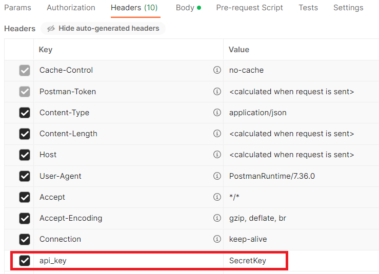
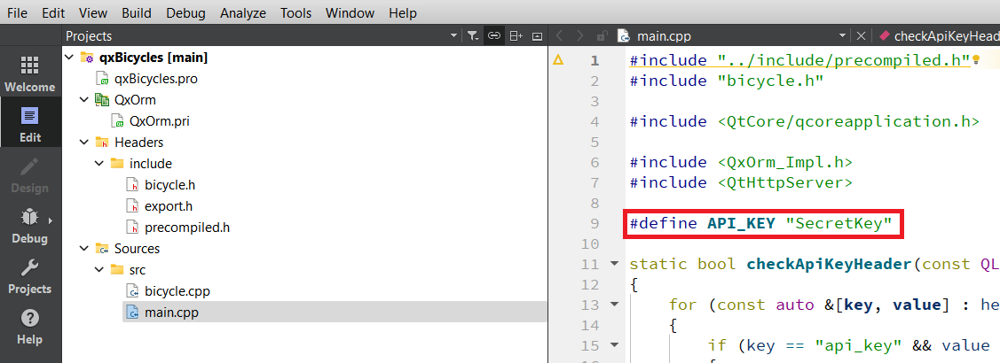

# Simple API CRUD using QxOrm & QtHttpServer & SQLite

This example is just that: A very simple API CRUD using:
 - QtHttpServer, to create the end-points of the API.
 - QxOrm, as ORM to access a SQLite database.
 - SQLite, as the the database. It could be any other supported by QxOrm as MySQL for instance.

This example is based on 2 examples:
* https://felgo.com/doc/qt/qthttpserver-addressbook-example/, to get the basics of the API CRUD.
* https://www.qxorm.com/qxorm_en/tutorial.html. The example qxBlog in QxOrm tutorials.
 
## Getting Started

It's interesting that you first work on a simple API CRUD with QtHttpServer: 
 - https://github.com/tcrurav/QtHttpServerCRUD.git

After that read about QxOrm:
 - https://www.qxorm.com/

### Prerequisites

You need a working environment with:
* [Git](https://git-scm.com) - You can install it from https://git-scm.com/downloads.
* [Qt](https://www.qt.io/download-open-source) - Install the community version.
* [QxOrm](https://www.qxorm.com/) - For Windows follow this instructions: https://www.qxorm.com/qxorm_en/tutorial_3.html.

## General Installation instructions

This project has been tested using Qt6.6.1 and QxOrm 1.4.9.

I have installed QxOrm with the following options:
 - I used Windows 11.
 - I have used Qt 6.6.1.
 - I have installed QxOrm 1.4.9.
 - I haven't installed the Boost options in the tutorial: https://www.qxorm.com/qxorm_en/tutorial_3.html.
 - After finishing the tutorial I have opened the project QxOrm using Qt Creator 12.1 with MinGW.
 
In this moment check that the libraries libQxOrmd.dll and libQxOrmd.dll.a have been created in the directory QxOrm\lib of your installation.

Once you have followed the instructions to install Qt and QxOrm be sure that the example QxBlog in the directory ````QxOrm\test\qxBlog```` works perfectly. I opened it clicking on qxBlog.pro using qmake.

Once you are sure QxBlog works, then clone this project in your QrOrm\test directory:
```
git clone https://github.com/tcrurav/QxOrmHttpServerCRUDSQLite.git
```

Open and run the project from the Qt Creator clicking on qxBicycles.pro using qmake.

You can test the endpoints with the following POSTMAN:
https://documenter.getpostman.com/view/3446841/2s9YywdeFP

It's IMPORTANT to mention that the following header is necessary to do the POST, PUT and DELETE:


this header value must match the line in main.cpp:


Enjoy!!!

## Curl requests

GET http://127.0.0.1:49080/v2/bicycle
````
curl --location 'http://127.0.0.1:49080/v2/bicycle'
````

GET http://127.0.0.1:49080/v2/bicycle/1
````
curl --location 'http://127.0.0.1:49080/v2/bicycle/1'
````

GET http://127.0.0.1:49080
````
curl --location 'http://127.0.0.1:49080'
````

POST http://localhost:49080/v2/bicycle
````
curl --location 'http://localhost:49080/v2/bicycle' \
--header 'api_key: SecretKey' \
--data '{
    "brand":"Carrera",
    "model":"Speed"
}'
````

PUT http://localhost:49080/v2/bicycle/1
````
curl --location --request PUT 'http://localhost:49080/v2/bicycle/1' \
--header 'api_key: SecretKey' \
--data '{
    "brand":"Fitipaldi",
    "model":"Super speed"
}'
````

DELETE http://localhost:49080/v2/contact/1
````
curl --location --request DELETE 'http://localhost:49080/v2/contact/1' \
--header 'api_key: SecretKey'
````

## Built With

* [Qt Creator](https://www.qt.io/download-open-source) - Install the community version.
* [QxOrm](https://www.qxorm.com/) - For Windows follow this instructions: https://www.qxorm.com/qxorm_en/tutorial_3.html.

## Acknowledgments

* https://felgo.com/doc/qt/qthttpserver-addressbook-example/. RESTful server Address Book Example. This project is basically this example.
* https://www.qxorm.com/. For Windows follow this instructions: https://www.qxorm.com/qxorm_en/tutorial_3.html.
* https://doc.qt.io/qt-6/qthttpserver-colorpalette-example.html. RESTful API Server
* https://doc.qt.io/qt-6/qthttpserver-simple-example.html. Simple HTTP Server
* https://www.w3schools.com/cpp/. An introduction to C++.
* https://github.com/PurpleBooth/a-good-readme-template. A good README.md template.